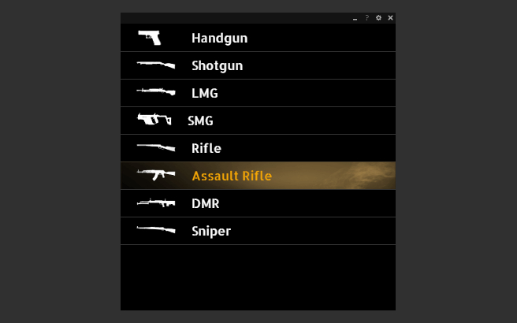
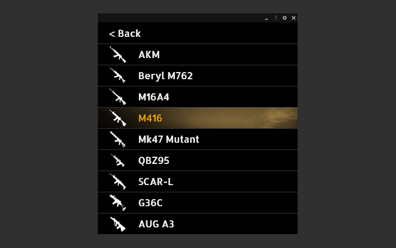

# PUBG Recoil

## What is PUBG Recoil?
PUBG Recoil is an ultimate PUBG weapon & attachment recoil guide with over **400+ different recoil patterns**.

It allows you to quickly and easily compare recoil for weapons with different attachments while in-game and playing PUBG. It's the best tool for players who want to learn and improve their aim control!

### Select category

### Select weapon

### Select attachments

If you have any further questions or suggestions, feel free to reach out [here](https://github.com/markovic-nikola/pubg-recoil/issues) or check our [FAQ](./faq.md).